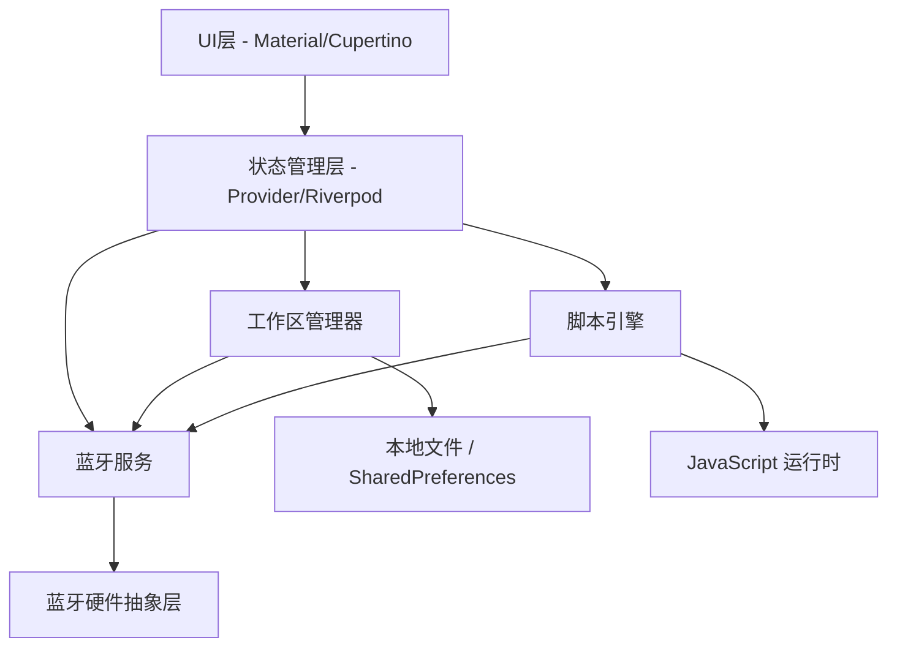

# BLExpert 项目说明

## 1. 项目目标

BLExpert 是一款基于 Flutter 的跨平台蓝牙调试与分析工具，面向 Android、iOS、Windows、macOS、Web 等平台，用于提升物联网与嵌入式开发中的设备联调效率。

它的核心价值是把“设备协议差异大、调试协作分散、数据处理零散”这几类问题收拢到一个统一工作区中，形成可复用、可导入导出、可脚本化的数据调试环境。

## 2. 核心能力

### 2.1 工作区管理

每一款蓝牙设备对应一个独立工作区。工作区内应包含：

- 设备基础信息
- 指令集
- 解析脚本
- 数据映射表
- 连接参数与调试配置
- 导入 / 导出所需的完整配置

### 2.2 蓝牙通信

支持以下能力：

- 设备扫描
- 连接与断开
- 服务发现
- 特征值发现
- 数据读写
- 通知订阅
- 收发日志记录

协议覆盖范围：

- BLE Central（本项目不支持经典蓝牙 SPP）

### 2.3 可编程脚本引擎

在 Dart 侧集成 JavaScript 运行时，支持在发送前与接收后执行脚本，用于处理原始 HEX 数据。

脚本需要支持：

- 协议头尾拼装与剥离
- CRC8 / CRC16 / CRC32
- XOR / SUM 等校验
- 应用层加解密
- 数据重组、格式化与分发

### 2.4 智能数据解析与映射

支持将原始 HEX 数据解析为有实际含义的字段，例如：

- 温度
- 湿度
- 电量
- 状态位
- 设备标识

解析方式应同时支持脚本和模板配置，以便兼顾灵活性和可维护性。

### 2.5 工作区导入 / 导出

支持将完整工作区导出为单文件配置，例如 JSON。

导入后应尽量做到“开箱即用”，适合团队协作、样例分发与设备方案复用。

### 2.6 实时数据可视化

收发数据应支持多种展示格式：

- HEX
- ASCII
- JSON
- 时间戳记录

后续可扩展简单图表，例如波形图、趋势图、状态变化图。

## 3. 技术选型建议

- Flutter 3.19+ 或最新稳定版
- BLE：`universal_ble`
- 脚本引擎：`flutter_js`
- 状态管理：`provider` 或 `riverpod`
- 本地持久化：`shared_preferences` + `path_provider`
- 图表：`fl_chart`
- UI：Material + Cupertino 混合风格，兼顾跨平台一致性与原生感

## 4. 建议架构



## 5. 目录结构建议

```bash
lib/
├── main.dart
├── models/
│   ├── workspace.dart
│   ├── device_profile.dart
│   └── script_config.dart
├── services/
│   ├── bluetooth_service.dart
│   ├── script_engine.dart
│   ├── workspace_manager.dart
│   └── export_import_service.dart
├── providers/
│   ├── app_state.dart
│   └── workspace_state.dart
├── screens/
│   ├── workspace_list_screen.dart
│   ├── workspace_editor_screen.dart
│   ├── device_scan_screen.dart
│   └── debug_console_screen.dart
├── widgets/
│   ├── hex_editor.dart
│   ├── script_editor.dart
│   └── data_mapper.dart
└── utils/
    ├── hex_utils.dart
    ├── crc_utils.dart
    └── crypto_utils.dart
```

## 6. 开发阶段

### 阶段一：基础框架搭建

- 创建项目结构与路由
- 实现设备扫描与连接
- 实现基础收发与 HEX 展示

### 阶段二：工作区与脚本引擎

- 工作区 CRUD 与持久化
- 集成 JavaScript 引擎
- 建立发送前 / 接收后的脚本回调

### 阶段三：高级功能

- 数据解析映射与结构化展示
- 工作区导入 / 导出
- 常用 CRC / XOR 示例库

### 阶段四：优化与测试

- 多平台兼容性验证
- 脚本执行性能优化
- 用户文档与示例工作区

## 7. 当前实施优先级

当前优先做两件事：

1. 建立工作区的数据模型
2. 实现设备扫描与连接的基础框架

这两项会决定后续蓝牙调试、脚本处理和导入导出功能的接口形状，建议先稳住它们。

